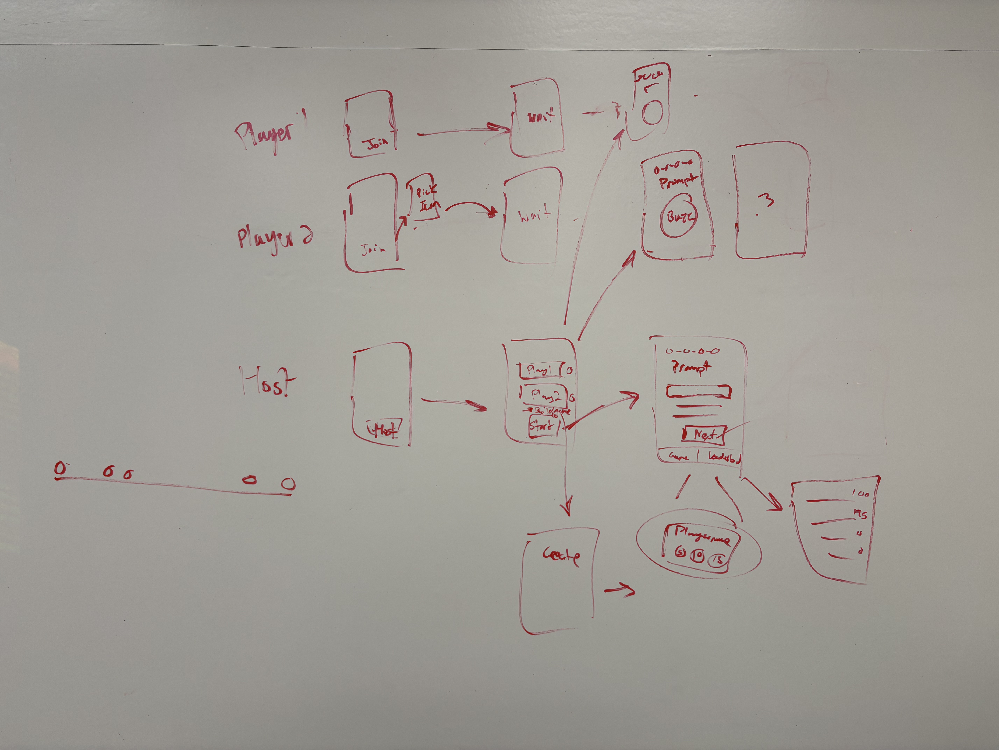

# Introducing Shleeb!

Shleeb is a buzzer app for at-home games such as Family Feud. To host a game, simply open the app and press "Host", choose your game settings, and start the game! To join a game, open the app and press "Join", enter your username and buzz when you wish to answer!

## Preliminary Sketches

## Human Interface Guidelines
I made the vibrations optional based off of the HIG guidelines, they are toggleable in the settings.
I also made two styles for the vibrations from HIG, transient haptics when the game advances to the next stage and when the host receives the first buzz, and continuous haptics for when a player buzzes.
I made all colors except for the brand purple have one meaning as HIG recommends (red: destructive, yellow: gold, brown: bronze)
I made the buzzer scream very simple to make sure the two major components had space to breathe and to make it as easy to read as possible, according to HIG's recommendation about giving essential items sufficient space.

# shleeb
